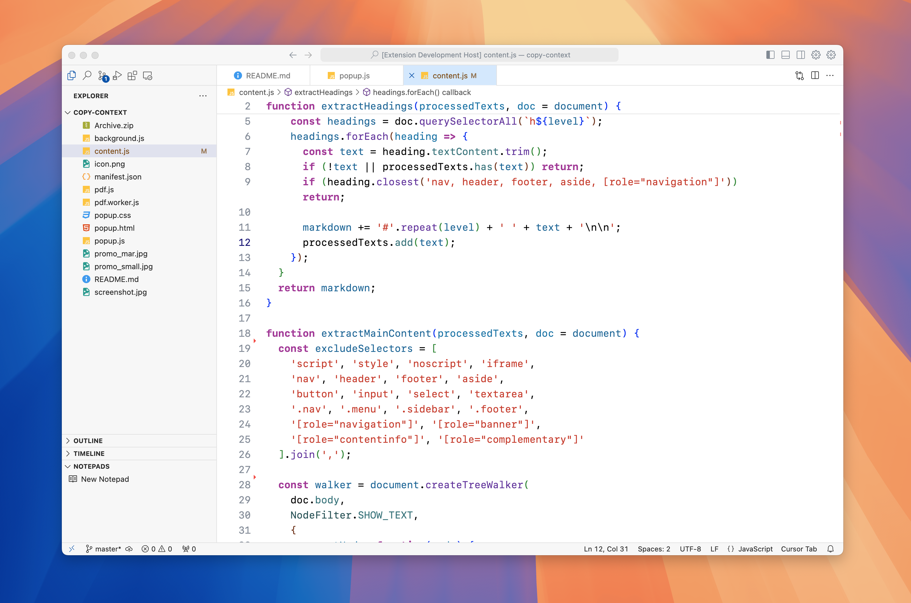
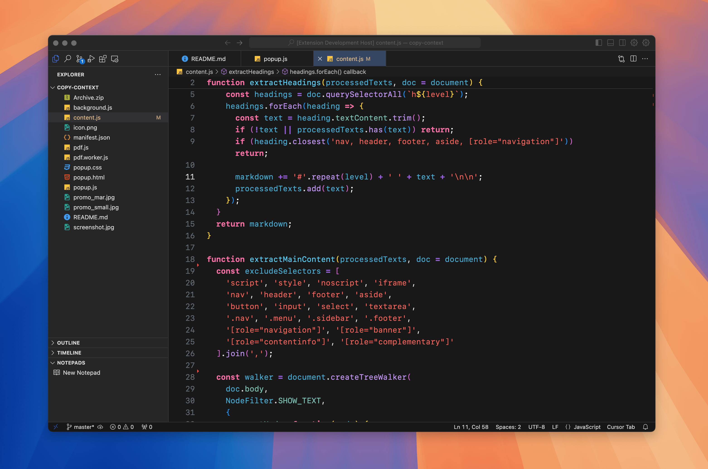

# XCode Modern Theme

  

A carefully crafted VS Code theme that brings the modern XCode IDE experience to Visual Studio Code. This theme combines the best elements of XCode's design philosophy with VS Code's functionality, creating a familiar and comfortable environment for macOS developers.

## Features

- 🎨 **Native macOS Aesthetics**: Carefully designed to match modern XCode and native macOS applications
- 🎯 **Semantic Highlighting**: True XCode-style semantic syntax highlighting
- 🖼️ **Clean UI**: Polished tab bars, title bars, and icon rendering that mirrors modern XCode
- 👀 **Enhanced Readability**: Improved contrast in light mode for better visibility
- 🌓 **Light and Dark Variants**: Seamlessly switch between light and dark themes

## Screenshots

## Installation

1. Open VS Code
2. Press `⌘ + P`
3. Type `ext install xcode-modern`
4. Press Enter

## Activation

1. Press `⌘ + K ⌘ + T`
2. Select either:
   - `XCode Modern Light`
   - `XCode Modern Dark`

## Inspiration

This theme is inspired by:
- Modern XCode IDE design
- [CodeEdit](https://github.com/CodeEditApp/CodeEdit) - A native macOS code editor
- [XCode Theme](https://github.com/MateoCerquetella/xcode-theme) - Original XCode theme for VS Code

## Contributing

Found a bug or have a suggestion? Feel free to:

1. [Open an issue](https://github.com/yourusername/xcode-modern/issues)
2. [Submit a pull request](https://github.com/yourusername/xcode-modern/pulls)

## License

MIT License - feel free to use in your own projects

---

**Enjoy coding with the familiar feel of XCode in VS Code! 🚀**
